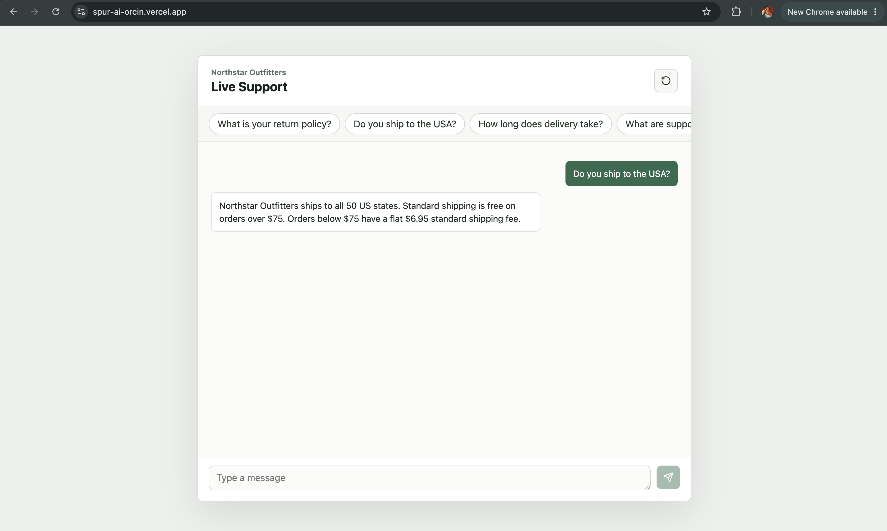

# Spur AI Live Chat Agent

Mini AI support agent for a live chat widget. The app lets a user chat with a fictional e-commerce support agent, persists conversation history, retrieves relevant FAQ knowledge, and calls OpenAI when a valid API key is available.

Built for the Spur Founding Full-Stack Engineer take-home.

## Screenshot



## Stack

| Area | Choice |
| --- | --- |
| Frontend | React + Vite |
| Backend | Python + FastAPI |
| Database | SQLite via SQLAlchemy |
| LLM | OpenAI Chat Completions |
| Testing | Pytest |

I used FastAPI because it gives strong request validation, clean dependency injection, and a small amount of framework code for this scope.

## Features

- Live chat UI with user and AI message bubbles.
- Starter question chips for common support questions.
- Enter-to-send, disabled send while loading, typing indicator, and auto-scroll.
- Session persistence in `localStorage`.
- Conversation reload by `sessionId`.
- SQLite persistence for conversations, messages, and FAQ knowledge.
- Seeded Northstar Outfitters FAQ knowledge.
- OpenAI integration behind a dedicated LLM service.
- FAQ fallback when no OpenAI key is configured or the LLM call fails.
- Human handoff simulation for sensitive or order-specific questions.
- Input validation, history caps, output token caps, rate limiting, and daily token budget checks.

## Project Structure

```text
backend/
  main.py                    FastAPI app factory, CORS, startup seeding
  app/api/                   HTTP routes
  app/core/                  Settings and environment config
  app/db/                    SQLAlchemy session setup and seed data
  app/models/                Database models
  app/repositories/          Database access layer
  app/schemas/               Pydantic request/response schemas
  app/services/              Chat, LLM, knowledge, rate limit, token logic
  tests/                     Backend API tests

frontend/
  src/api/                   Backend API client
  src/components/            Chat UI components
  src/styles.css             App styling
```

Request flow:

```text
React UI -> FastAPI route -> ChatService -> repositories + KnowledgeService + LlmService -> SQLite + OpenAI
```

## Local Setup

### 1. Backend

```bash
cd backend
python3 -m venv .venv
source .venv/bin/activate
pip install -r requirements.txt
cp .env.example .env
uvicorn main:app --reload --port 8001
```

Health check:

```bash
curl http://localhost:8001/health
```

Expected:

```json
{"status":"ok"}
```

Send a chat message:

```bash
curl -X POST http://localhost:8001/chat/message \
  -H "Content-Type: application/json" \
  -d '{"message":"What is your return policy?"}'
```

### 2. Frontend

In a second terminal:

```bash
cd frontend
cp .env.example .env
npm install
npm run dev
```

Open:

```text
http://localhost:5173
```

The frontend calls `VITE_API_BASE_URL`, which defaults to `http://localhost:8001` in `.env.example`.

## Environment Variables

Backend:

| Variable | Default | Purpose |
| --- | --- | --- |
| `DATABASE_URL` | `sqlite:///./dev.db` | SQLAlchemy database URL |
| `FRONTEND_ORIGIN` | `http://localhost:5173` | Allowed CORS origin |
| `OPENAI_API_KEY` | empty | Optional OpenAI API key |
| `OPENAI_MODEL` | `gpt-4o-mini` | OpenAI model name |
| `LLM_TIMEOUT_SECONDS` | `12` | LLM timeout |
| `MAX_INPUT_CHARS` | `2000` | User message length cap |
| `HISTORY_LIMIT` | `12` | Recent messages sent to the LLM |
| `MAX_OUTPUT_TOKENS` | `300` | LLM output cap |
| `RATE_LIMIT_PER_IP_PER_MINUTE` | `20` | Per-IP local rate limit |
| `RATE_LIMIT_PER_SESSION_PER_MINUTE` | `10` | Per-session local rate limit |
| `DAILY_TOKEN_BUDGET_PER_SESSION` | `20000` | Estimated daily budget per session |

Frontend:

| Variable | Default | Purpose |
| --- | --- | --- |
| `VITE_API_BASE_URL` | `http://localhost:8001` | Backend API base URL |

## Database and Seed Data

SQLite is used by default for local development. The deployed Render backend uses Render Postgres by setting `DATABASE_URL` to the database's internal connection string. SQLAlchemy handles both databases through the same repository/model layer, and `psycopg2-binary` is included in `backend/requirements.txt` for Postgres support.

On backend startup, the app:

1. Creates tables from SQLAlchemy models.
2. Seeds FAQ knowledge if the `knowledge_items` table is empty.

Seeded knowledge covers:

- shipping to the USA
- delivery times
- returns
- refund timing
- support hours
- warranty
- cancellation
- payment methods

The local SQLite file is `backend/dev.db` and is ignored by git. In production, conversations and messages persist in Render Postgres.

## API

### `POST /chat/message`

Request:

```json
{
  "message": "What is your return policy?",
  "sessionId": "optional-existing-session-id"
}
```

Response:

```json
{
  "reply": "Unused items can be returned within 30 days...",
  "sessionId": "conversation-uuid",
  "metadata": {
    "provider": "openai"
  }
}
```

### `GET /chat/{sessionId}/messages`

Returns persisted messages for a conversation.

### `GET /health`

Returns:

```json
{"status":"ok"}
```

## LLM and Prompting

The LLM integration is isolated in `backend/app/services/llm_service.py`.

The system prompt tells the agent to:

- act as a support agent for Northstar Outfitters
- answer only from provided store knowledge and recent conversation context
- avoid inventing policies, dates, discounts, order status, or timelines
- recommend human support when the answer is unknown, sensitive, or order-specific
- keep replies under 120 words

Before calling OpenAI, the backend selects up to 3 relevant FAQ items using lightweight keyword matching. It also sends only the most recent configured messages from the conversation history.

If `OPENAI_API_KEY` is missing, or if OpenAI fails due to timeout/quota/network errors, the app returns a deterministic FAQ-grounded fallback answer instead of crashing.

## Robustness

Implemented safeguards:

- Pydantic validation rejects empty and oversized messages.
- Session IDs are UUIDs.
- LLM calls are timeout wrapped.
- LLM errors are caught and handled.
- Unknown/sensitive/order-specific requests trigger human handoff metadata.
- In-memory rate limiting protects per-IP and per-session traffic.
- Estimated token budget limits runaway sessions.
- Generic exception handler avoids leaking stack traces to the frontend.

## Tests

Run backend tests:

```bash
cd backend
pytest
```

Covered:

- health check
- empty message validation
- new session creation
- existing session reuse
- user and AI message persistence
- handoff for sensitive/order-specific messages
- missing history returns `404`
- rate limit returns `429`

## Trade-offs and Future Work

- Backend is FastAPI instead of TypeScript. I chose speed, validation, and clean layering for this exercise.
- Rate limiting is in memory. Production should use Redis.
- FAQ retrieval is keyword based. Vector search or embeddings would improve recall.
- SQLite is used locally and Postgres is used on Render for deployed persistence.
- LLM responses are non-streaming. Streaming would improve perceived latency.
- Handoff is simulated through metadata. A real agent inbox could consume `handoff_requested` conversations.
- Current frontend has manual QA only. Backend has automated coverage for core behavior.
- Prompt-injection protection could be strengthened with explicit instruction hierarchy, refusal rules for attempts to override system/developer instructions, retrieval filtering, and automated eval cases for malicious user prompts.
